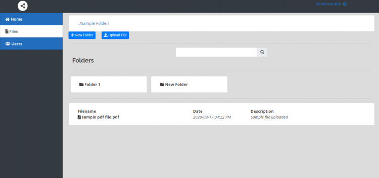

# phpmyfiles 
previously File Management System using PHP
  
  

### Description

This system is a file or document sharing web application that is developed using PHP/MySQLi, HTML, CSS, JavaScript (jQuery, Ajax), and Bootstrap. The system allows the user to store their documents along with the description of the file. The users can also organize his/her files by creating folders to compile the related files into one.

### Features

<ul>
  <li>User Management</li>
  <li>Upload files or documents</li>
  <li>Organize into directory</li>
  <li>Download files</li>
  <li>Share files to other users.</li>
</ul>

Visit [sourcecodester.com](https://www.sourcecodester.com/php/14454/file-management-system-using-phpmysql.html) for the other details and information about the File Management System.

#### Website Info
| Title | File Management System using PHP/MySQLi with Source Code |
|:------|:---------------------------------------------------------|
| Website | [sourcodester.com](https://www.sourcecodester.com/) |
| Link   | https://www.sourcecodester.com/php/14454/file-management-system-using-phpmysql.html |
| Uploader | [oretnom23](https://www.sourcecodester.com/users/tips23)  |
| Language | [PHP](https://www.sourcecodester.com/php) |
